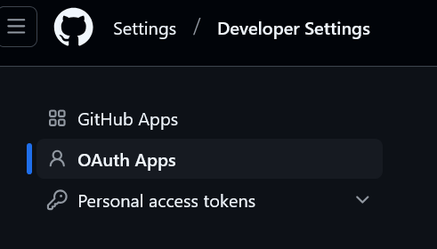
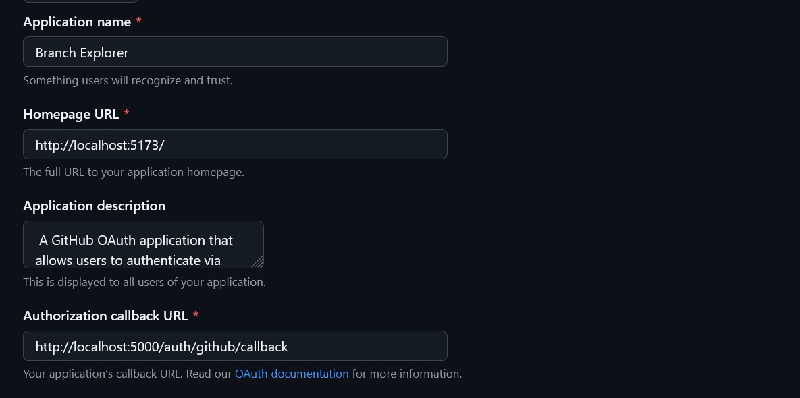
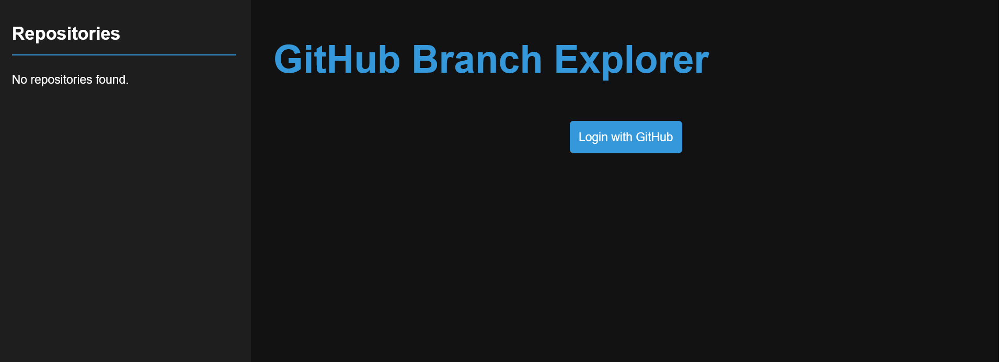
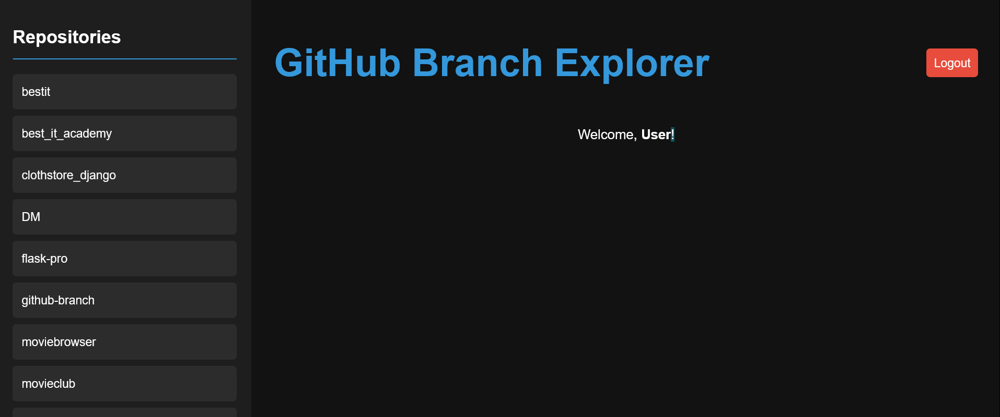
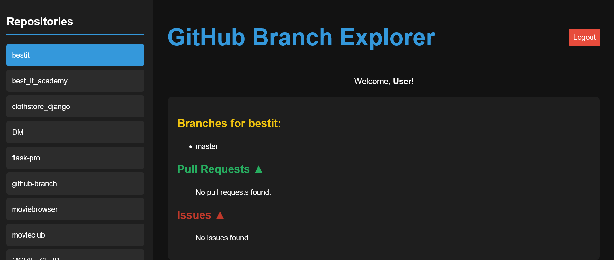

# GitHub Branch Explorer

## Project Overview
GitHub Branch Explorer is a web application that allows users to authenticate with GitHub and explore their repositories, branches, pull requests, and issues in a structured UI.

## Features
- **GitHub OAuth Login** - Users can log in using GitHub authentication.
- **Repository Selection** - Displays all repositories of the authenticated user.
- **Branches View** - Lists all branches for the selected repository.
- **Pull Requests** - Shows open and closed pull requests.
- **Issues** - Displays open and closed issues.
- **Dark-Themed UI** - Uses black, dark blue, and dark gray colors.
- **Collapsible Sections** - PRs and Issues can be expanded or collapsed.

## Tech Stack
- **Frontend**: React, Context API, Axios
- **Backend**: Node.js, Express, Passport.js
- **Authentication**: GitHub OAuth (via Passport.js)
- **API**: GitHub REST API

##  Project Structure
```
📁 github-branch-explorer
 ├── 📁 frontend (React App)
 │    ├── src
 │    │   ├── components
 │    │   ├── context (AuthContext.js)
 │    │   ├── App.jsx
 │    │   ├── index.js
 │    ├── package.json
 │    ├── README.md
 ├── 📁 backend (Node.js + Express)
 │    ├── server.js
 │    ├── package.json
 │    ├── .env
 ├── README.md
```

## ️ Setup Instructions

### **1️⃣ Clone the Repository**
```sh
git clone https://github.com/srikanthbanothu26/github-branch.git
cd github-branch
```

### **2️⃣ Backend Setup**
```sh
cd backend
npm install
```
Create a `.env` file in the backend directory and add:
```
GITHUB_CLIENT_ID=your_github_client_id
GITHUB_CLIENT_SECRET=your_github_client_secret
SESSION_SECRET=random_secret
CALLBACK_URL=http://localhost:5000/auth/github/callback
FRONTEND_URL=http://localhost:5173
```
Run the backend:
```sh
node server.js
```

### **3️⃣ Frontend Setup**
```sh
cd frontend
npm install
npm run dev
```

### **4️⃣ Open the App**
Visit: [http://localhost:5173](http://localhost:5173) in your browser.

## 📸 Screenshots 

### github Oauth Application
**GO TO GITHUB/ SETTINGS / DEVELOPER SETTINGS/ OAUTH APPS** 


**CREATE OAUTH APPLICATION**

**Frontend View for user LOGIN through github**


**Frontend view for logout and dispay Reprositories,branches,pull request,branch issues.**




##  License
This project is open-source and available for anyone to use.

